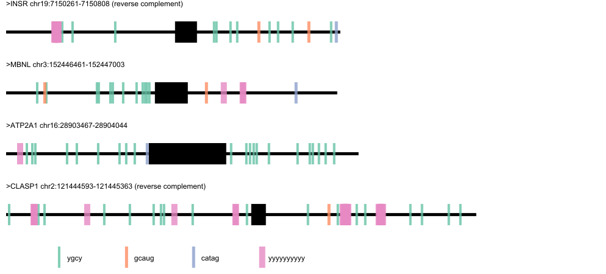

# motif-mark-oop

### Quick Start

```
### Install pycairo
conda install -c conda-forge pycairo

### Running code
./motif_mark.py -f path/to/file.fasta -m path/to/motif.txt
```

### Example output:



### Other details:

- For each `<file.fasta>`, one image will be drawn containing all genes contained 
in the file. *While any number of genes can be included in the file, the recommended max is 10.* 
- Image will be saved in `<file.svg>` format. 
- Gene map is drawn to scale.
